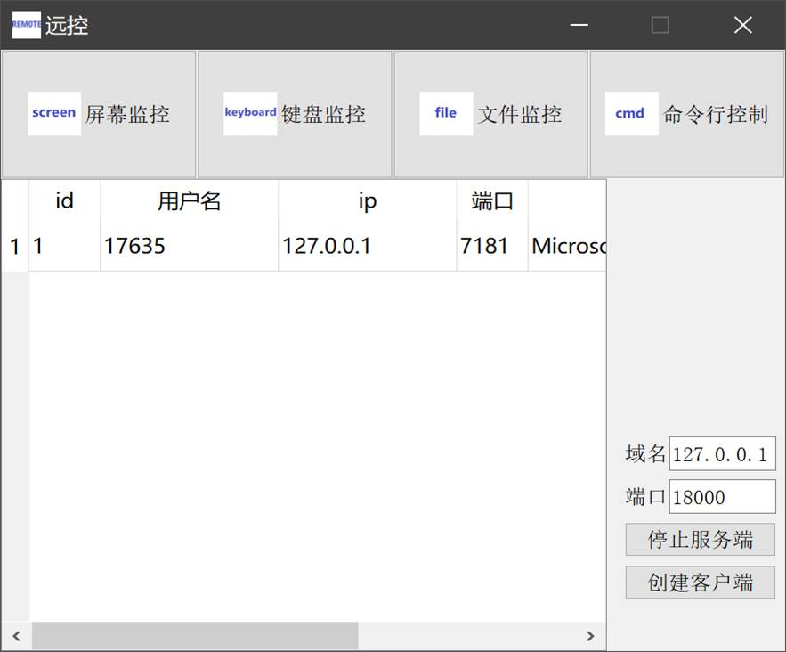
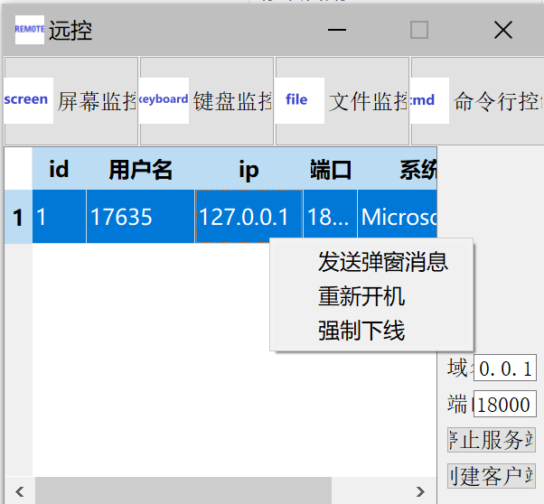

基于QT开发的一款远程控制软件，采用C/S架构中的反向连接，主控端作为服务器，被控端作为客户端，被控端主动连接主控端的IP和端口，且被控端序作为后台程序运行。

四个主要功能：键盘监控、文件监控、屏幕监控、命令行控制器。

截图演示：

##### 屏幕监控

在客户端截屏，接着使用JEPG压缩，最后传输给服务端，形成一个动态的连续画面；

服务器发送指令，客户端不断传送截屏的数据，使用Qt的QPixmap类画到窗口上，进而达到实时监控的效果。

##### 键盘监控

客户端启动一个新线程来做监控，创建一个不可见的窗口来处理win32事件。安装键盘钩子来截取系统的所有键盘输入，定时发送窃取的数据；

服务端接收客户端发过来的键盘数据，然后打印到窗口里。

##### 文件监控

客户端编写遍历目录和遍历文件夹函数，以及查找所有盘符。创建新线程，连接到服务器，接收和处理来自服务器的指令和数据等。以及添加处理文件的功能，获取文件、下载文件、上传文件、删除文件。发送文件到服务端和从服务端接收文件都要开启一个新线程。

服务端。添加服务端向客户端发送的指令和客户端向服务端发送的指令，添加处理指令来获取所有盘符、客户端目录下的所有目录和文件。以及添加处理文件的功能。

参考资料：https://blog.csdn.net/sumkee911/article/details/53709689